# Real-Time Weather Streaming with Azure

## Project Description
   
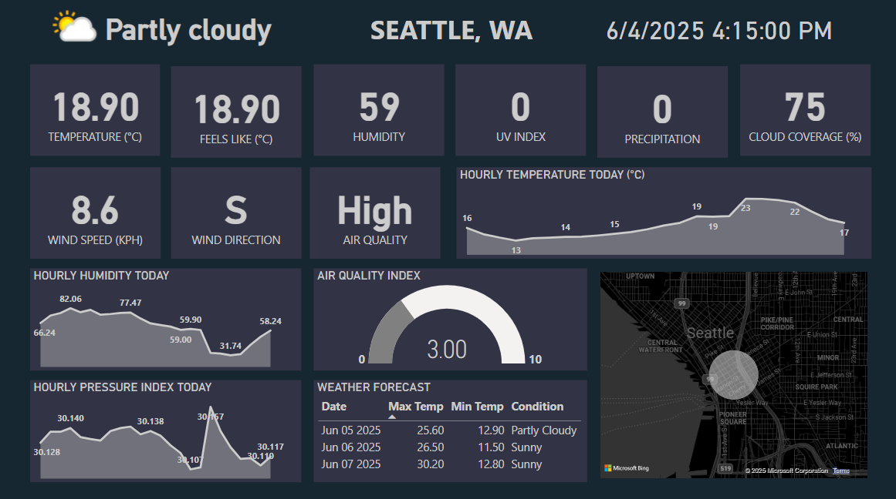

This project demonstrates the implementation of a real-time weather monitoring and alerting system using Microsoft Azure’s data platform. It integrates live weather data ingestion, real-time streaming, advanced analytics, interactive reporting, and automated alerting. The solution is built with enterprise-grade tools such as Azure Databricks, Azure Functions, Event Hub, Microsoft Fabric, and Power BI.

## Overview

The system collects real-time weather data from a public API and ingests it into Azure using two ingestion pipelines: Azure Databricks and Azure Functions. The ywo methods are compared for cost-efficiency and performance and the best method is determined. The data is streamed through Event Hub, processed using Microsoft Fabric’s real-time intelligence components, and stored in a Kusto DB instance. Microsoft Fabric's Event Stream is used to create a continuous streaming and storage pipeline with Event Hub as the source and Kusto DB present in an Event House as the target storage location. An interactive dashboard is built with Power BI for visualization, while Data Activator is configured to send automated email alerts for extreme weather events.

## Solution Architecture
   
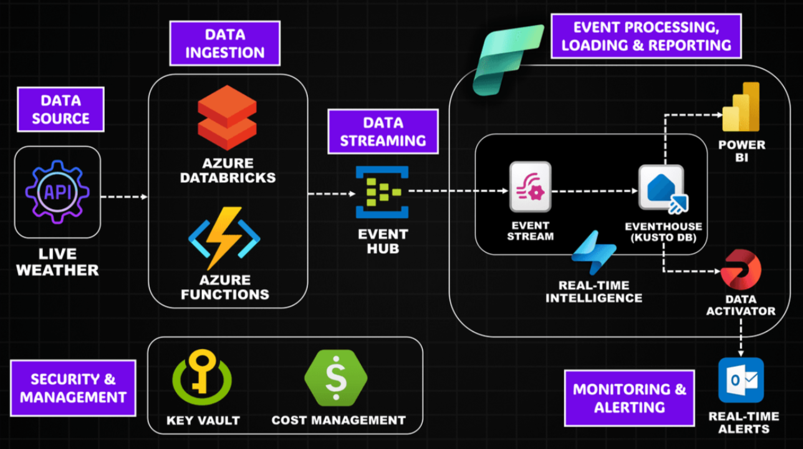

The architecture includes the following key components:

1. **Live Weather API** – Acts as the primary data source providing continuous real-time weather data.
2. **Azure Databricks** – Performs structured streaming and sends data to Event Hub at regular intervals.
3. **Azure Functions** – A timer-triggered alternative ingestion method that pushes events every 30 seconds.
4. **Event Hub** – A streaming service to capture and distribute real-time data.
5. **Microsoft Fabric (Event Stream & Real-Time Intelligence)** – Facilitates live processing and routing of events.
6. **Eventhouse (Kusto DB)** – A highly performant database for real-time query and analytics.
7. **Power BI** – Provides interactive dashboards connected to Kusto DB.
8. **Data Activator** – Detects predefined weather thresholds and triggers email alerts.
9. **Azure Key Vault** – Manages and secures API keys and other secrets.
10. **Cost Management** – Tracks resource usage and manages cost efficiency.

## Real-World Value

This solution provides significant value across various domains:

- **Personal Safety**: Users receive immediate email alerts during hazardous weather conditions such as storms or extreme temperatures, enabling timely response.
- **Business Operations**: Industries like logistics and aviation can use this system to monitor real-time conditions and proactively manage delays or disruptions.
- **Government & Emergency Services**: Local agencies can monitor live weather feeds and automate alerts for disaster response and planning.

## Technology Stack

| Layer                      | Technology Used                          |
|---------------------------|-------------------------------------------|
| Data Source               | Live Weather API                          |
| Ingestion                 | Azure Databricks, Azure Functions         |
| Streaming                 | Azure Event Hub                           |
| Processing & Storage      | Microsoft Fabric Event Stream, Kusto DB   |
| Analytics & Visualization | Power BI                                  |
| Alerting & Automation     | Microsoft Fabric Data Activator           |
| Security                  | Azure Key Vault                           |

## Step-by-Step Implementation

### 1. Azure Environment Setup
- Created a dedicated Azure Resource Group for centralized resource management.
- Configured Azure Key Vault to store API keys securely.
- Set up access control and role-based permissions across all services.
  
  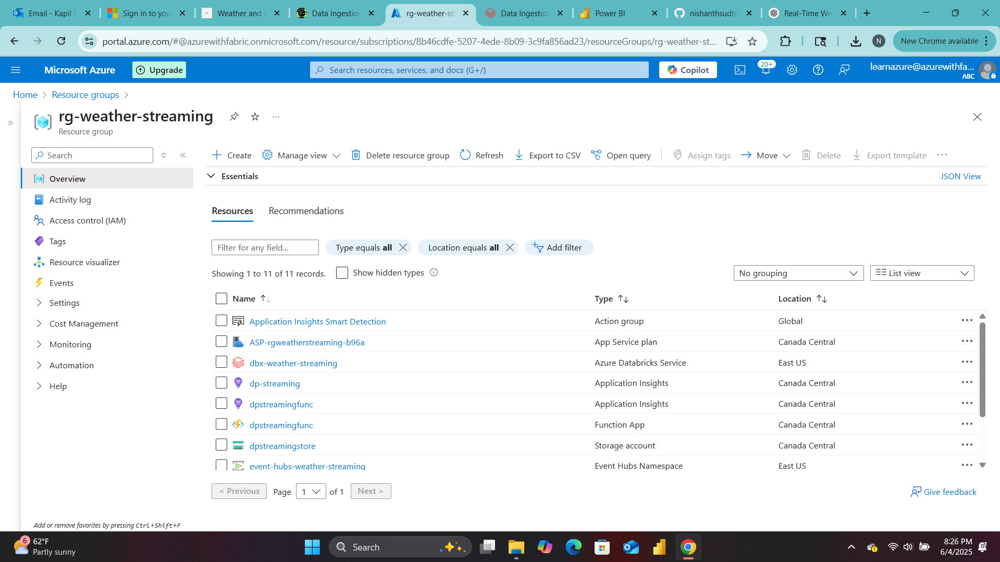

   

### 2. Data Ingestion

**Using Azure Databricks**
- Connected to the Live Weather API.
- Built a structured streaming job to push events to Event Hub every 30 seconds.
  
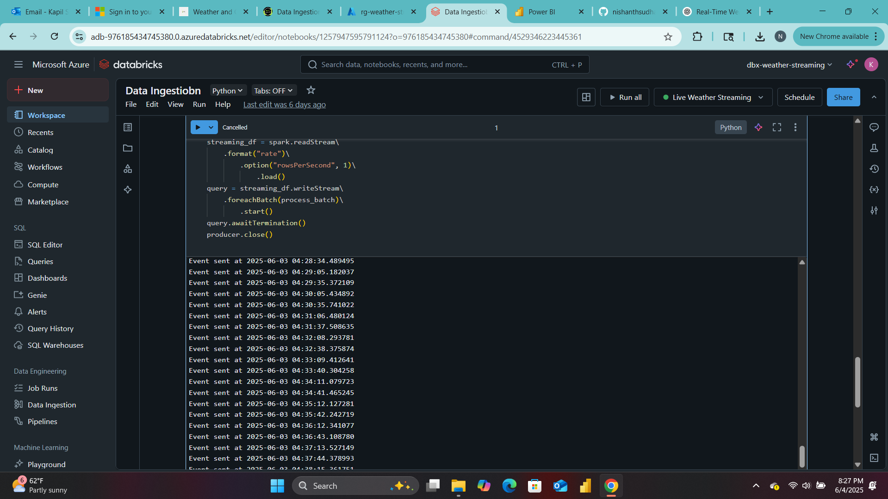
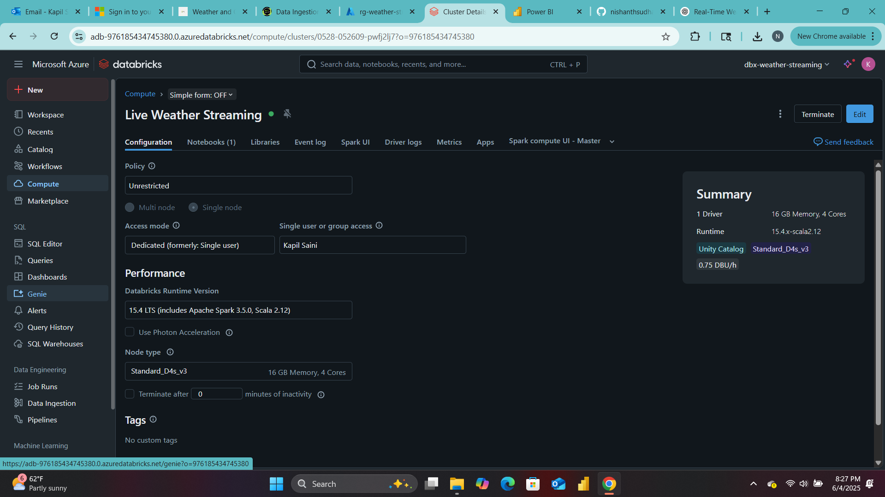

**Using Azure Functions**
- Created a timer-triggered Azure Function using Visual Studio Code.
- Deployed the Function App to Azure and validated its behavior with Event Hub integration.
  
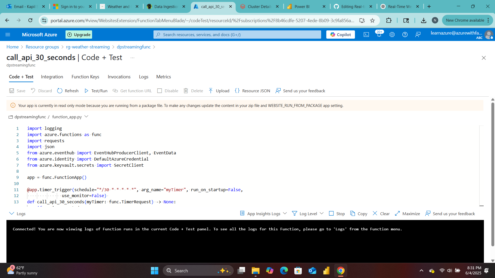

- Check if events are received in Event Hub
  
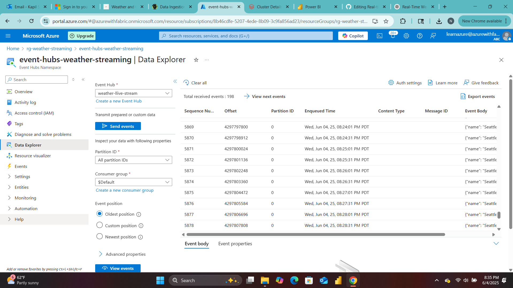

### 3. Real-Time Streaming   

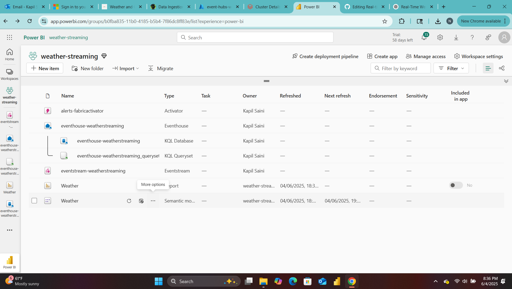
- Created a new Eventhouse (KQL Database) in Microsoft Fabric.
  
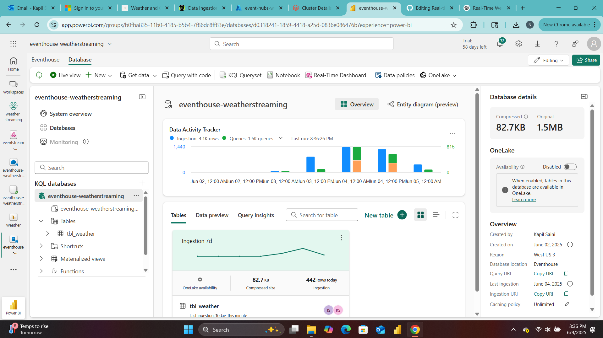
- Configured Event Stream to automatically route data from Event Hub to Kusto DB.
  
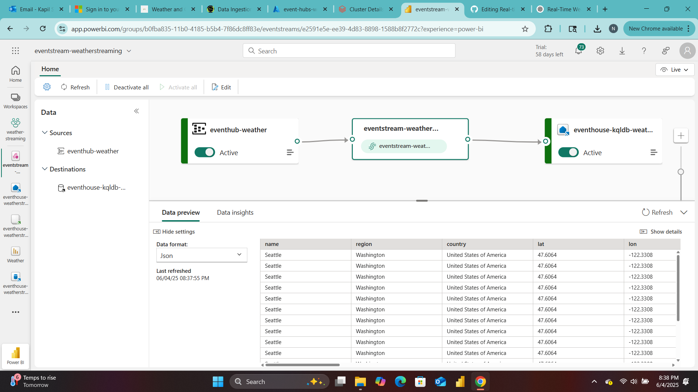
- Applied Kusto Query Language (KQL) for real-time analytics.
  
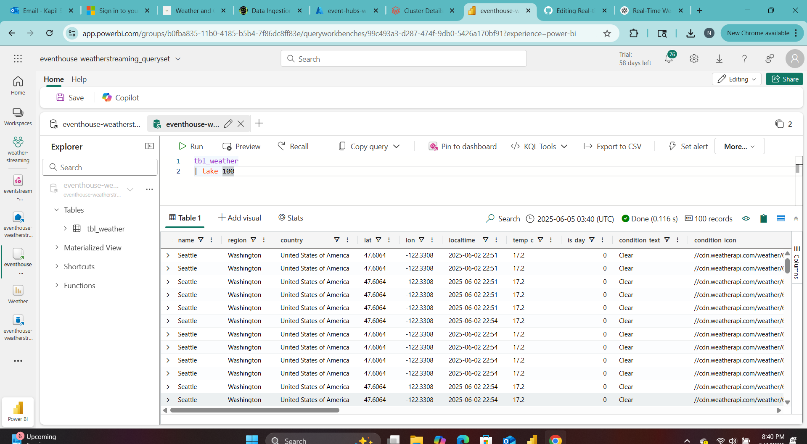

### 4. Reporting and Visualization
- Connected Power BI to the Eventhouse (Kusto DB).
- Built a real-time dashboard to visualize metrics such as temperature, humidity, and wind speed.
- Enabled auto-refresh and scheduled refresh for consistent updates.
  
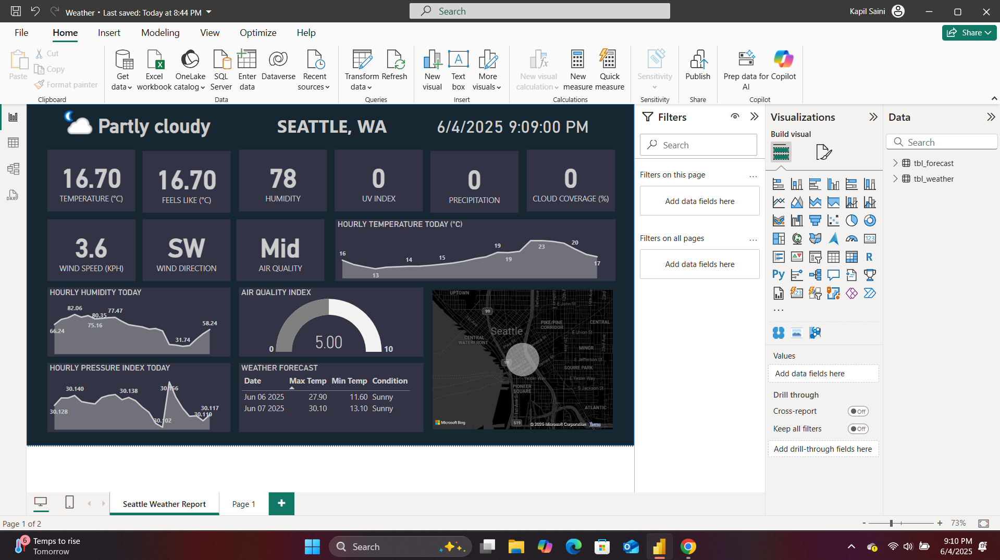

### 5. Alerting and Automation
- Defined critical weather conditions (e.g., temperature > 100°F or wind speed > 50 mph).
- Set up Data Activator to monitor these conditions and send alerts.
- Integrated with Outlook to deliver real-time email notifications.
- Tested the pipeline by sending mock events and verifying alert delivery.
  
  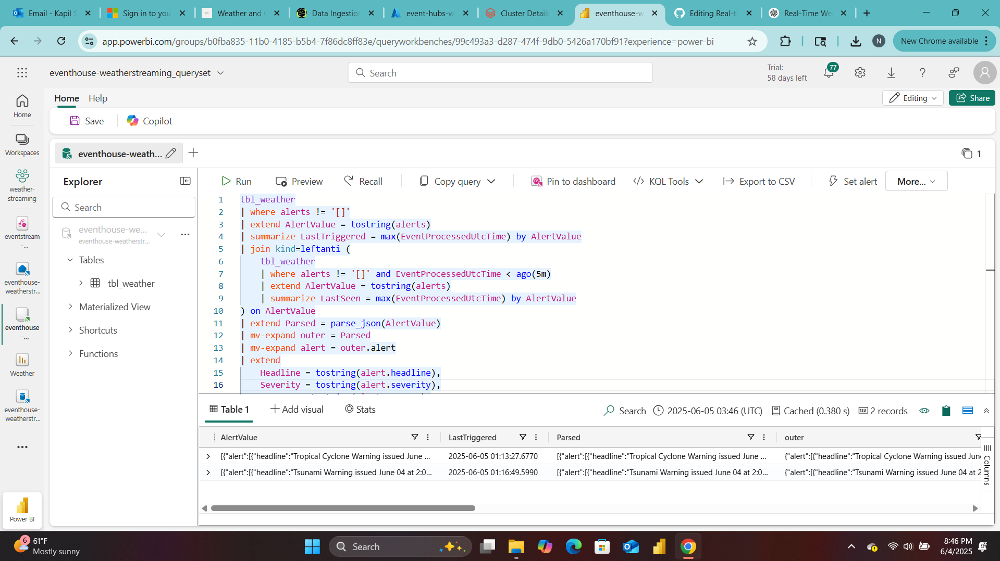
  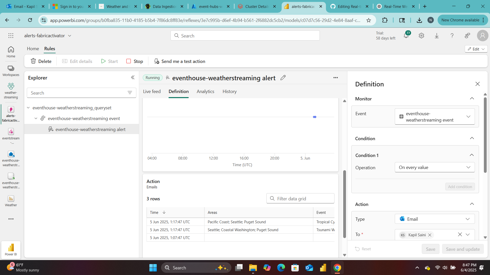
  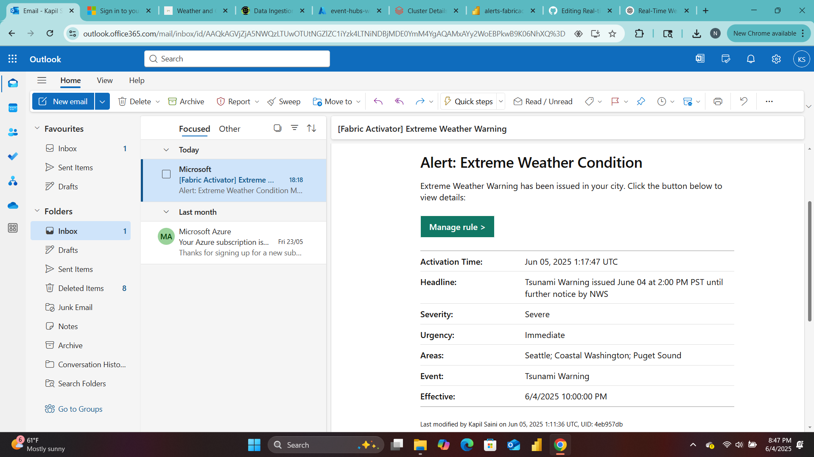
  
  
#### KQL Query to gather new alerts
tbl_weather   
| where alerts != '[]'   
| extend AlertValue = tostring(alerts)    
| summarize LastTriggered = max(EventProcessedUtcTime) by AlertValue   
| join kind=leftanti (   
    tbl_weather   
    | where alerts != '[]' and EventProcessedUtcTime < ago(5m)   
    | extend AlertValue = tostring(alerts)   
    | summarize LastSeen = max(EventProcessedUtcTime) by AlertValue   
) on AlertValue   
| extend Parsed = parse_json(AlertValue)   
| mv-expand outer = Parsed   
| mv-expand alert = outer.alert   
| extend   
    Headline = tostring(alert.headline),   
    Severity = tostring(alert.severity),   
    Urgency = tostring(alert.urgency),   
    Areas = tostring(alert.areas),   
    Event = tostring(alert.event),   
    Effective = tostring(alert.effective),   
    Expires = tostring(alert.expires),   
    Description = tostring(alert["desc"]),   
    Instruction = tostring(alert.instruction)   

  #### Query Logic Explanation
This KQL query is designed to detect and extract new weather alerts from the tbl_weather table in real time. It begins by filtering for rows where the alerts field is not empty (alerts != '[]'), then parses the alert data as a string (AlertValue) and finds the most recent occurrence (LastTriggered) of each unique alert. It uses a leftanti join to exclude alerts that were already seen more than 5 minutes ago, ensuring that only new or currently active alerts are processed. Data Activator runs the query evry 5 minutes and hence the 5 minute window in the KQL to retrieve only the unseen alerts. The query then parses the JSON structure of the alert, expands nested arrays (outer.alert), and extracts key alert attributes such as headline, severity, urgency, effective/expiry times, and instructions. This logic ensures that only fresh, actionable alerts are returned, making it ideal for driving real-time notifications or dashboards in weather monitoring systems.

## Conclusion

This project delivers a scalable, real-time weather monitoring system using the Microsoft Azure ecosystem. It enables proactive decision-making through live analytics and automated alerts, making it suitable for both individual and organizational use. The solution highlights best practices in cloud-based data engineering, from ingestion and streaming to visualization and alerting.

This project serves as a strong template for building real-time analytics applications and can be extended to domains such as IoT monitoring, fleet tracking, environmental monitoring, and emergency alert systems.

